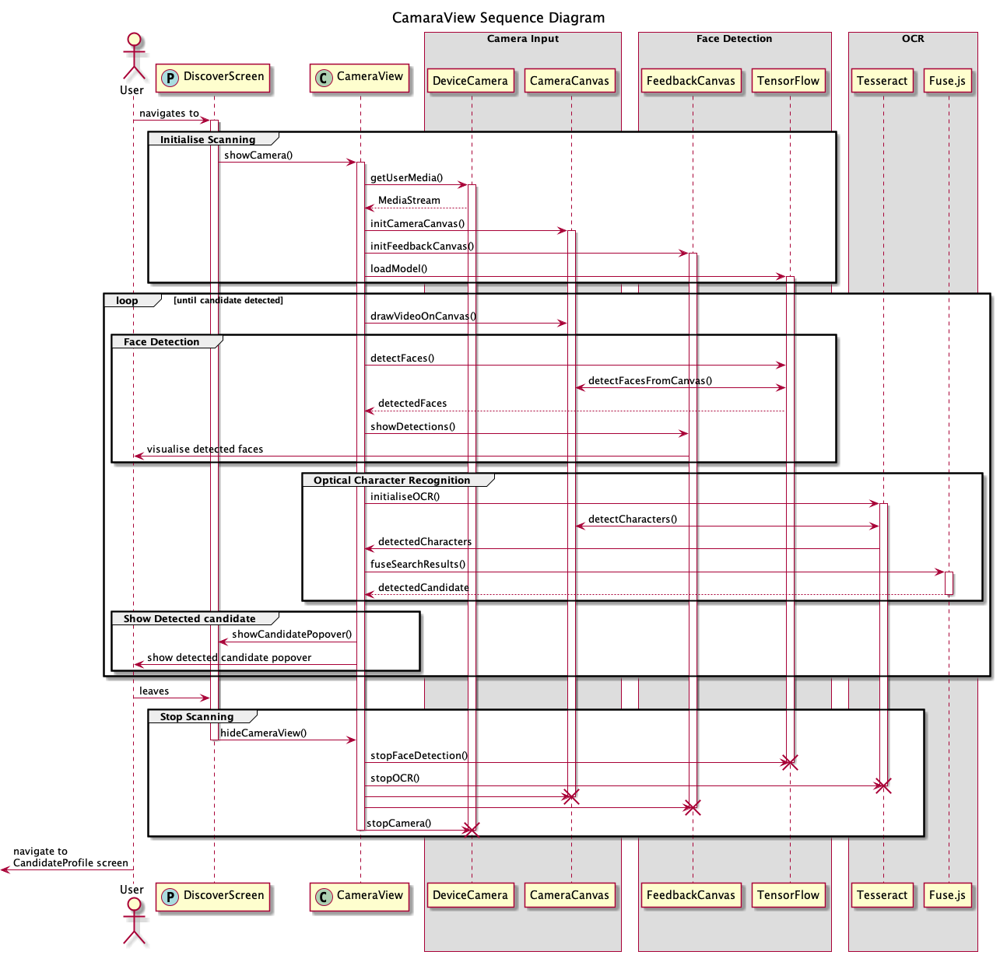

# Developer Documentation Poster Scanning <!-- omit in TOC -->

This is the developer documentation for the election poster scanning feature implemented in the [CameraView component](https://github.com/Face-the-Facts/mobile-app/blob/develop/src/components/CameraView.tsx) which is a vital part of the [Face the Facts application](https://facethefacts.app). It enables users to access information about the political candidates running for office in their constituency directly on the election poster. The feature is powered by [WebRTC](https://webrtc.org/) in combination with the HTML `<video>` and `<canvas>` elements alongside the machine learning library [TensorFlow.js](https://www.tensorflow.org/js) as well as the optical character recognition engine [Tesseract.js](https://tesseract.projectnaptha.com/).

## Contents <!-- omit in TOC -->

-   [Camera Access](#camera-access)
-   [Poster and Candidate detection](#poster-and-candidate-detection)
    -   [Face Detection](#face-detection)
    -   [Optical Character Recognition](#optical-character-recognition)

## Camera Access

The application uses the device camera to access the election poster the user is standing before. To achieve this, the HTML standards WebRTC and canvas are implemented in the frontend.

The device camera is accessed using WebRTC's [`getUserMedia()` function](https://developer.mozilla.org/en-US/docs/Web/API/MediaDevices/getUserMedia). The function returns a `MediaStream` object containing a live video stream. The stream is used as a source object for a HTML `<video>` element to display the camera feed to the user. Additionally, the camera feed is drawn onto a HTML `<canvas>` element. It is used as an intermediary between the video feed and the machine learning libraries. This is necessary because the libraries do not support the `<video>` element as an input.

## Poster and Candidate detection

After obtaining a video feed from the user's device, the feed is processed further to first, detect the presence of an election poster in the video using face detection, and second, recognise the candidate depicted on the poster using optical character recognition. The first step is achieved using the [TensorFlow.js](https://www.tensorflow.org/js) library, the second using [Tesseract.js](https://tesseract.projectnaptha.com/).

### Face Detection

Face detection is implemented using [TensorFlow](https://www.tensorflow.org/js) and its [Blazeface model](https://github.com/tensorflow/tfjs-models/tree/master/blazeface). Upon running the model, a bounding box is returned which is drawn on a second `<canvas>` element, the FeedbackCanvas, overlaying the aforementioned `<video>` element.

### Optical Character Recognition

For recognising which candidate is depicted on the election poster, optical character recognition using [Tesseract](https://tesseract.projectnaptha.com/) is implemented. It initiates a web worker which takes the video feed drawn on the `<canvas>` element and attempts to detect characters from it. The web worker's output contains most, if not all of the characters present in the image, but it also comes with a lot of noise. To filter this out, [fuse.js](https://fusejs.io/), an approximate string matching library, is used. This is achieved using an array of candidate names which is then matched against the output from tesseract's web worker. Once there is a definite match to one of the candidates in the database, the user is presented with a layover on top of the camera feed giving them the possibility to navigate to the candidate's profile in the application.

UML Sequence Diagram for the CameraView component
